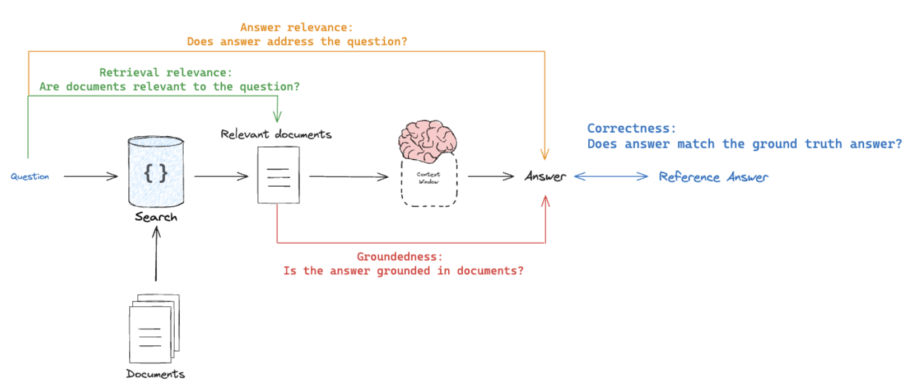

# EVALUATION: LangSmith

## Prompts: Evaluators (LLM-as-a-Judge)
- **NODE = Router**: Rule Adherence
- **NODE = Generate**: Correctness, Conciseness, 

## RAG: (LLM-as-a-Judge)

1. **Retrival Quality (Retrieval Relevance = Input vs Retrieved Docs):** Are documents relevant to the question?
2. **Hallucination (Groundedness = Response vs Retrieved Docs):** Is the answer grounded in documents?
3. **Answer Relevance (Relevance = Response vs Input):** Is the answer useful to address the question?

4. **Answer Accuracy (Correctness = Response vs Reference Answer):** Does the answer match the (Ground Truth) answer?
