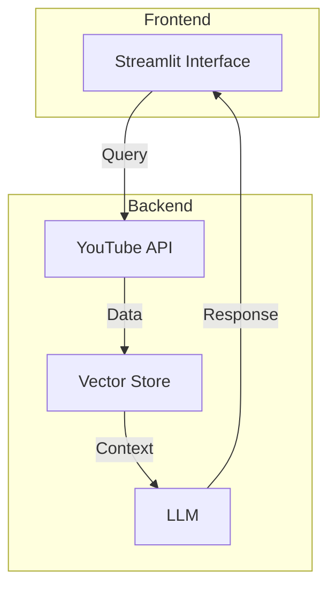

# How the YouTube Summarizer Works: A Detailed Breakdown

## Overview
https://gemini.google.com/share/b73f1f484949

This document explains the end-to-end process of your application, from the moment a user enters a topic to when they receive an intelligent answer from the chatbot. The entire system operates in two distinct phases.

## Phase 1: The Setup - Building the Knowledge Base 🏗️
This initial, one-time process is triggered when a user provides a topic and clicks "Create RAG Assistant." Its sole purpose is to gather information and build a specialized knowledge library, or "brain," for the AI to use.

### Process Flow
1. **Topic Submission** (`app.py`)
   - User enters a search term (e.g., "How to make sourdough bread")
   - Input captured via Streamlit web interface

2. **Video Search** (`youtube.py`)
   - Application sends request to YouTube Data API
   - Returns list of relevant video IDs

3. **Data Extraction** (`youtube.py`)
   - Fetches video metadata:
     - Title
     - Author
     - View count
   - Downloads full text transcripts using `youtube_transcript_api`

4. **Document Processing** (`vectorstore.py`)
   - Breaks down transcripts into manageable chunks
   - Creates overlapping text segments (~1000 characters)
   - Preserves semantic meaning

5. **Vectorization & Storage** (`vectorstore.py`)
   - Converts text chunks to vectors using OpenAI embeddings
   - Stores vectors in ChromaDB database
   - Creates searchable knowledge base

## Phase 2: The Conversation - Answering Questions 💬

### Process Flow
1. **User Query** (`app.py`)
   - User submits question via chat interface

2. **Intelligent Routing** (`workflow.py`)
   - Decision-making process:
     - Checks for "youtube" keyword
     - Sets action flag: `SEARCH_VIDEOS` or `DIRECT_ANSWER`

3. **Information Retrieval** (RAG Path)
   ```mermaid
   graph TD
      A[User Query] --> B{Contains 'youtube'?}
      B -->|Yes| C[Vector Search]
      B -->|No| D[Direct Answer]
      C --> E[Context Retrieval]
      E --> F[Response Generation]
      D --> F
   ```

4. **Response Generation** (`workflow.py` & `prompts.py`)
   - **RAG Path:**
     - Uses retrieved context
     - Applies `get_rag_prompt`
     - Generates contextual response
   
   - **Direct Path:**
     - Uses general knowledge
     - Applies `get_direct_prompt`
     - Generates standard response

5. **Final Output** (`app.py`)
   - Displays response in Streamlit chat window

## System Architecture


## Technical Stack
- **Frontend:** Streamlit
- **Backend:** Python
- **APIs:** YouTube Data API
- **Vector Store:** ChromaDB
- **LLM:** GPT-4o
- **Embeddings:** OpenAI

## Getting Started
[Add installation and setup instructions here]