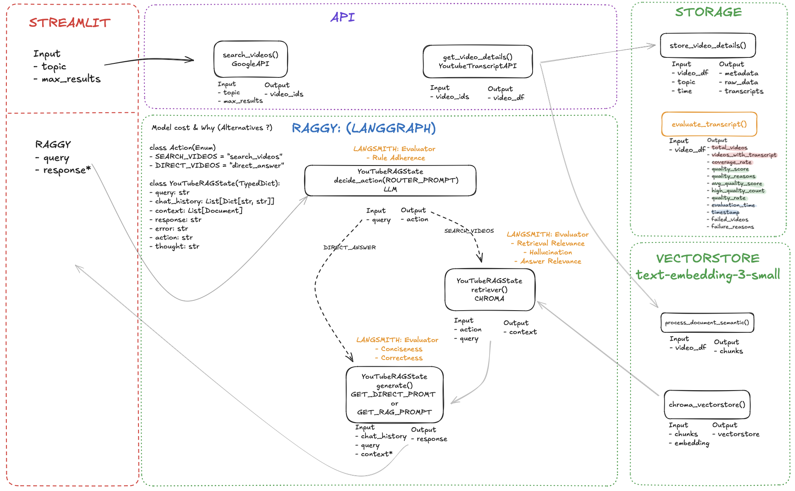

# How the YouTube Summarizer Works: A Detailed Breakdown

## Overview

**Vision Statement**
- To create an intelligent YouTube content analysis tool that transforms speech-heavy video content into searchable, conversational knowledge bases, enabling users to efficiently extract insights from podcast-style YouTube content.

**Mission**
- Democratize access to knowledge by making YouTube's vast repository of educational and discussion-based content easily searchable and conversable through AI-powered transcript analysis.

**Product Description**
- The YouTube Summarizer is a RAG (Retrieval-Augmented Generation) application that processes YouTube video transcripts to create intelligent chatbots capable of answering questions about specific topics. Users can search for videos on any topic, and the system builds a specialized knowledge base that can be queried conversationally.
- **📢 Important Note on Content Type:**
This YouTube Summarizer is optimized for **audio-heavy, speech-based content** such as podcasts, interviews, discussions, and lectures. Since the system relies on YouTube transcripts for analysis, it performs best with content where spoken dialogue is the primary information source.
- **Best Performance:** Podcasts, interviews, educational lectures, discussions
- **Limited Performance:** Visual tutorials, cooking shows, DIY videos, content with heavy visual demonstrations
- For optimal results, search for topics that are commonly discussed in podcast or interview formats.

## Phase 1: The Setup - Building the Knowledge Base 🏗️
This initial, one-time process is triggered when a user provides a topic and clicks "Create RAG Assistant." Its sole purpose is to gather information and build a specialized knowledge library, or "brain," for the AI to use.

### Process Flow
1. **Topic Submission** (`app.py`)
   - User enters a search term (e.g., "What is Langchain")
   - Input captured via Streamlit web interface

2. **Video Search** (`youtube.py`)
   - Application sends request to YouTube Data API
   - Returns list of relevant video IDs

3. **Data Extraction** (`youtube.py`)
   - Fetches video metadata:
     - Title
     - Author
     - View count
   - Downloads full text transcripts using `youtube_transcript_api`

4. **Document Processing** (`vectorstore.py`)
   - Breaks down transcripts into manageable chunks
   - Creates overlapping text segments (~1000 characters)
   - Preserves semantic meaning

5. **Vectorization & Storage** (`vectorstore.py`)
   - Converts text chunks to vectors using OpenAI embeddings
   - Stores vectors in ChromaDB database
   - Creates searchable knowledge base

## Phase 2: The Conversation - Answering Questions 💬

### Process Flow
1. **User Query** (`app.py`)
   - User submits question via chat interface

2. **Intelligent Routing** (`workflow.py`)
   - Decision-making process:
     - Checks for "youtube" keyword
     - Sets action flag: `SEARCH_VIDEOS` or `DIRECT_ANSWER`

3. **Information Retrieval** (RAG Path)

4. **Response Generation** (`workflow.py` & `prompts.py`)
   - **RAG Path:**
     - Uses retrieved context
     - Applies `get_rag_prompt`
     - Generates contextual response
   
   - **Direct Path:**
     - Uses general knowledge
     - Applies `get_direct_prompt`
     - Generates standard response

5. **Final Output** (`app.py`)
   - Displays response in Streamlit chat window

## Technical Stack
- **Frontend:** Streamlit
- **Backend:** Python, LangGraph
- **APIs:** YouTube Data API
- **Vector Store:** ChromaDB
- **LLM:** GPT-4o
- **Embeddings:** OpenAI